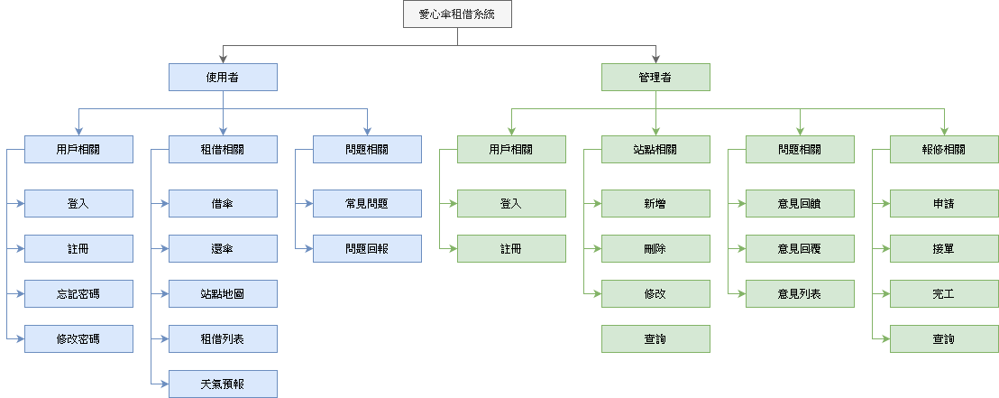

# 第3章 系統規格

## 3-1 系統架構

圖 3-1-1 系統架構圖

借傘時，使用者透過手機掃描傘架上的QRCode，取得傘架上的網址，會再次使用手機打API至伺服器，伺服器會確認使用者是否擁有借傘的資格(沒有未歸還紀錄等)，確認後會打訊號給傘架，請傘架進行開傘的動作。

還傘時，使用者再次透過手機掃描傘架上的QRCode，取得傘架上的網址，會再次使用手機打API至伺服器，伺服器會確認使用者是否有借傘的資格，確認後會打訊號給傘架，把傘架鎖起來。

管理者則可以使用網頁瀏覽器進行網頁版的管理者介面瀏覽，對傘架的設置地點及雨傘的提供進行管理。

圖 3-1-2 系統功能架構圖

## 3-2 系統軟、硬體需求與技術平台
表 3-2-1 伺服器端規格表
| 伺服器端規格 |  |
| --- | --- |
| 作業系統 | Windows Server 2012 R2 Datacenter |
| 開發環境 | Windows 10 |
| 整合式開發環境(IDE) | IntelliJ IDEA |
| 程式語言 | Java 11 |
| 框架 | Spring Boot 2.2.6 |
| 套件管理 | Gradle |
| 伺服器 | Apache Tomcat 9.0.33 Server |
| 資料庫 | MySQL |

表 3-2-2 手機端規格表
| 手機端規格 |  |
| --- | --- |
| 作業系統 | Android 10, iOS 13.4 |
| 開發環境 | macOS 10.15.4 |
| 整合式開發環境(IDE) | Android Studio 3.6.1, XCode 11.4 |
| 程式語言 | Dart 2.7.0 |
| 框架 | Flutter 1.12.13 |
| 套件管理 | Pub |

表 3-2-3 網頁端規格表
| 網站端規格 |  |
| --- | --- |
| 作業系統 | Windows Server 2012 R2 Datacenter |
| 開發環境 | Windows 10 |
| 整合式開發環境(IDE) | Visual Studio Code |
| 程式語言 |  |
| 框架 |  |
| 套件管理 |  |
| 伺服器 |  |

## 3-3 開發標準與使用工具
表 3-3-1 使用工具表
| 開發輔助工具 |  |
| --- | --- |
| 編輯器 | IntelliJ IDEA, Android Studio, XCode |
| 資料庫管理工具 | MySQL Workbench, DataGrip |
| 版本控制工具 | Git |
| API 測試工具 | Postman |
| API 文件 | Swagger |
| 文件撰寫工具 |  |
| 文件製作 | Microsoft Word 2019 |
| 簡報製作 | Microsoft PowerPoint 2019 |
| UML 工具 | Visual Paradigm for UML 7.2 Enterprise Edition |
| 介面設計工具 |  |
| 雛形設計 | Adobe XD |
| 製圖工具 | Adobe Photoshop, Adobe Illustrator |
| 專案管理工具 |  |
| 溝通工具 | LINE, Telegram |
| 版本控管 | GitHub |
| 影片軟體 |  |
| 剪輯軟體 | Adobe Premiere Pro |