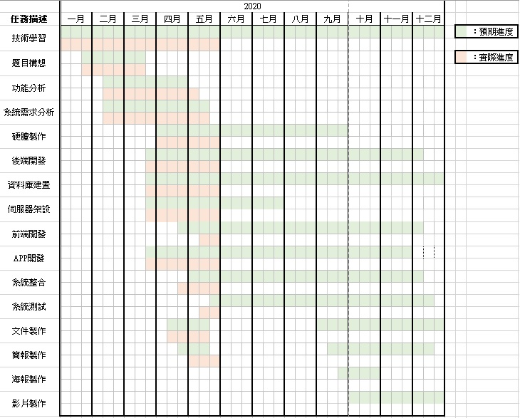

# 第4章 專案時程與組織分工

## 4-1 專案時程：甘特圖

 
圖 4-1-1 專案時程甘特圖

## 4-2 專案組織與分工
表 4-2-1 組織分工表

●：主要負責 ○：協助
|  |  | 10646003 黃峻彥 | 10646006 詹壹婷 | 10646007 李恩瑋 | 10646016 吳宇量 |
| --- | --- | --- | --- | --- | --- |
| 企劃 | 主題構想 | ● |  |  | ○ |
|  | 需求功能分析 | ○ |  | ○ | ● |
|  | 系統分析 | ○ |  | ● | ○ |
| 美術 | 介面設計 | ● | ○ |  |  |
|  | Logo設計 | ● |  |  |  |
| 系統 | 網頁設計 |  | ● |  |  |
|  | 前端開發 |  | ● |  |  |
|  | 後端開發 |  |  | ● |  |
|  | 資料庫建置 |  |  | ● |  |
|  | 伺服器架設 |  |  | ● |  |
|  | APP設計 | ● |  |  |  |
|  | 硬體製作 |  |  |  | ● |
| 報告 | 文件撰寫 | ● |  | ○ | ○ |
|  | 簡報製作 | ○ | ● |  | ○ |
|  | 海報製作 |  |  |  |  |
|  | 影片製作 |  |  |  |  |