# 第5章 需求模型

## 5-1 使用者需求

* 功能性需求：
  * 一般使用者：
    * 用戶相關：針對使用者個人登入、註冊、修改個人資訊。
    * 租借相關：針對租借愛心傘進行借傘、還傘、站點地圖、租借列表、天氣預報。
    * 問題相關：針對App使用上遇到的問題，提供常見問題以及問題回報。
  * 管理者：
    * 用戶相關：針對管理者個人登入、註冊、修改個人資訊。
    * 站點相關：針對站點進行新增、刪除、修改、查詢。
    * 問題相關：針對意見回饋進行修改、查詢。
    * 報修相關：針對裝置之報修資訊進行接單、完工、查詢。

* 非功能性需求：
  * 裝置需求：Android最低需4.1版、iOS最低需8.0版，且手機須能上網(行動網路、Wi-Fi)、定位以及有相機功能。

## 5-2 使用個案圖

  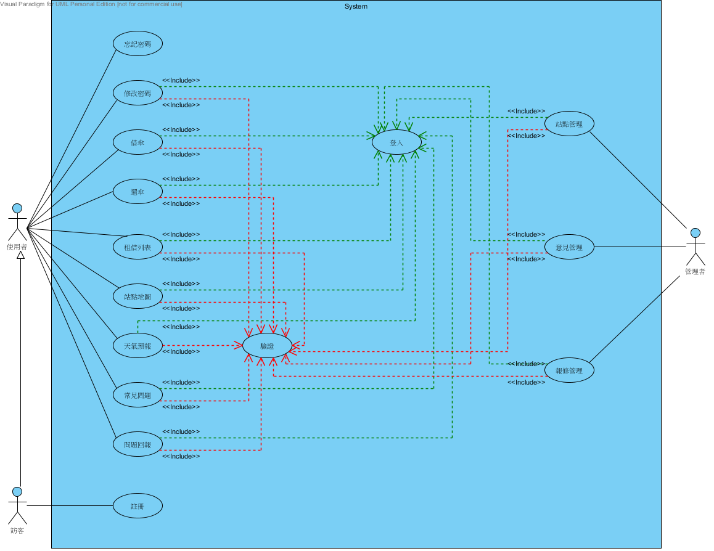
   
  圖5-2-1使用個案圖

## 5-3 使用個案描述

  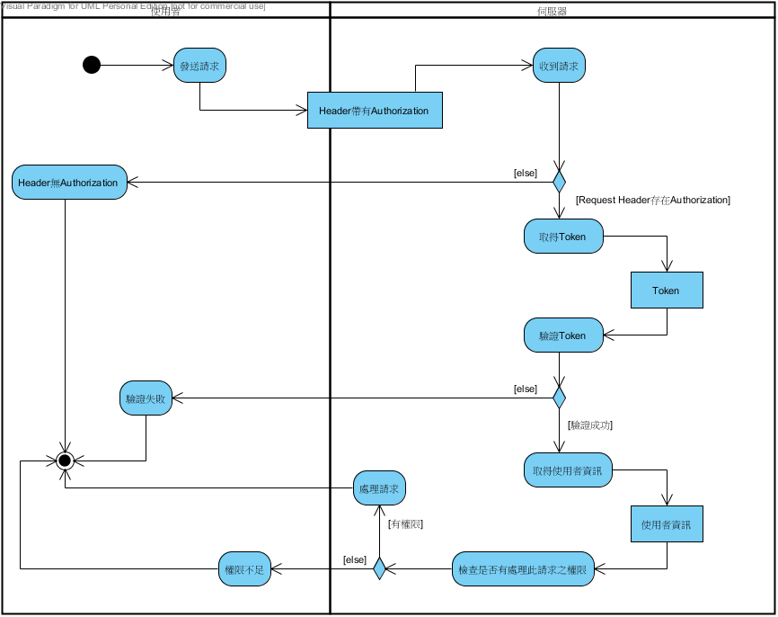
   
  圖5-3-1驗證之活動圖

  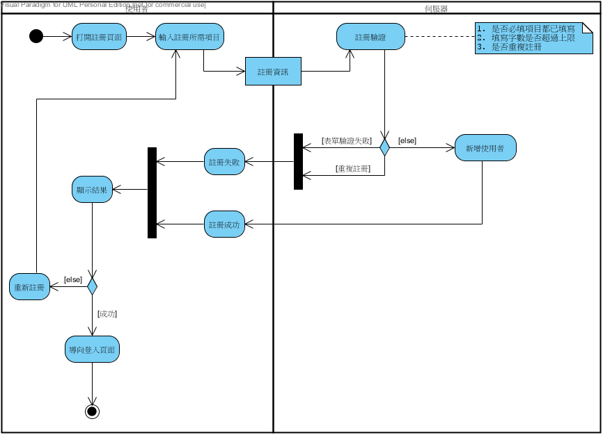
   
  圖5-3-2註冊之活動圖

  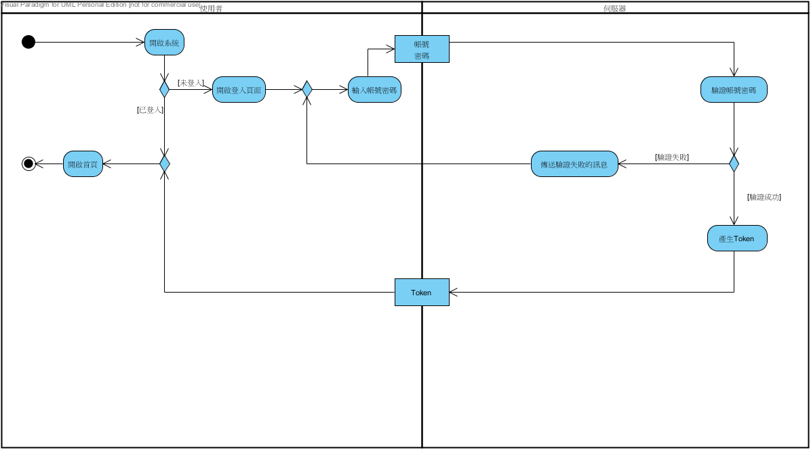
   
  圖5-3-3登入之活動圖

  
   
  圖5-3-4忘記密碼之活動圖

  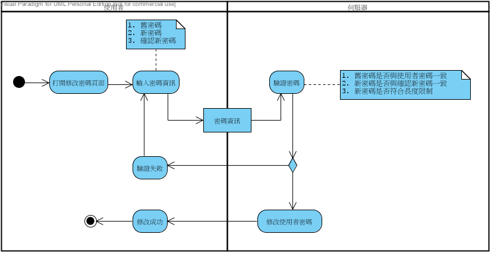
   
  圖5-3-5修改密碼之活動圖

  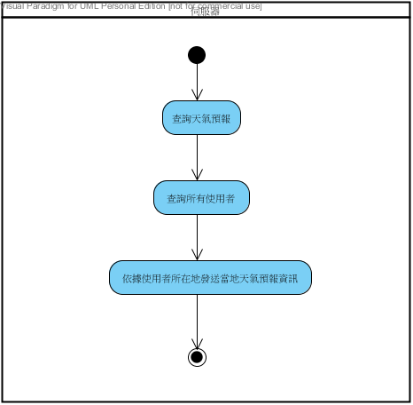
   
  圖5-3-6天氣預報推播之活動圖

  
   
  圖5-3-7站點地圖之活動圖

  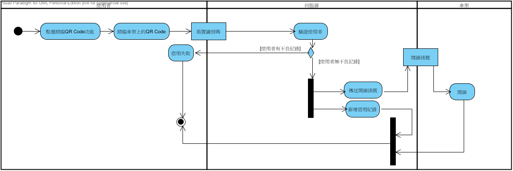
   
  圖5-3-8借傘之活動圖

  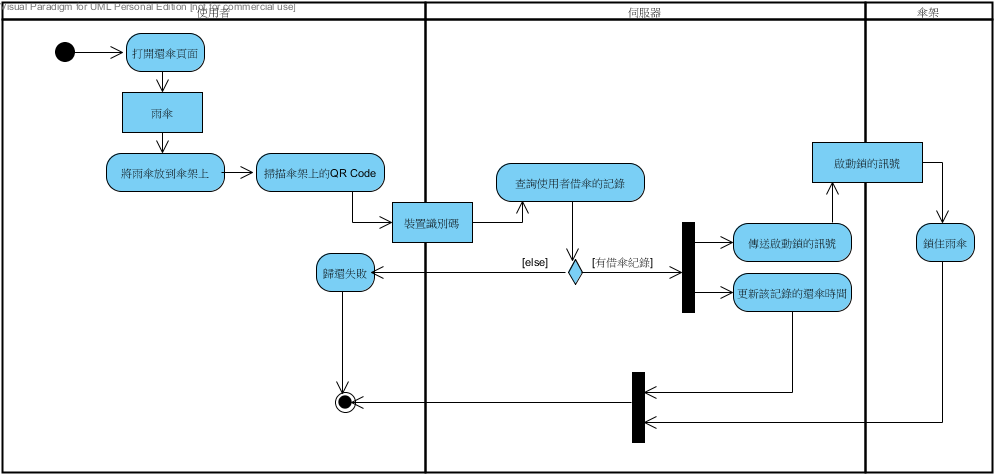
   
  圖5-3-9還傘之活動圖

  
   
  圖5-3-10回饋意見之活動圖

  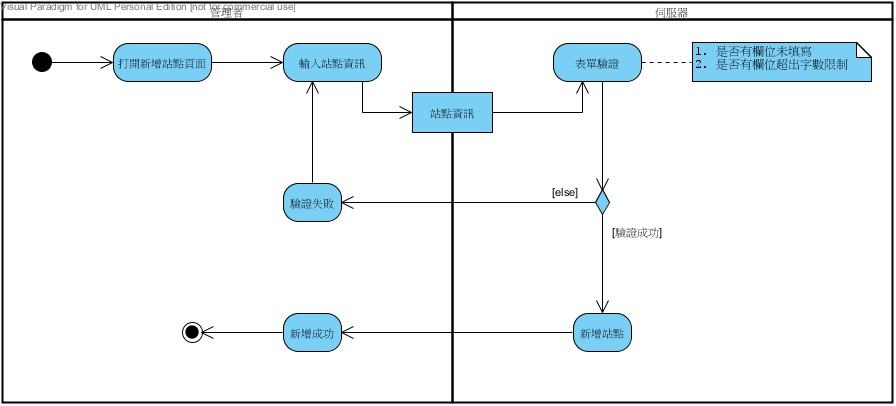
   
  圖5-3-11新增站點之活動圖

  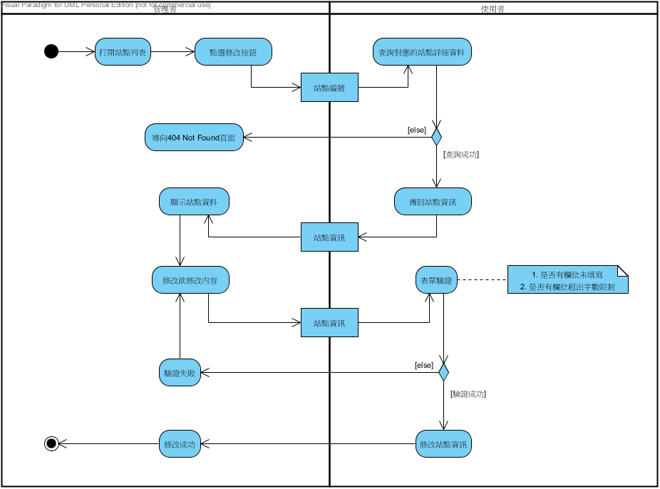
   
  圖5-3-12修改站點之活動圖

  
   
  圖5-3-13刪除站點之活動圖

  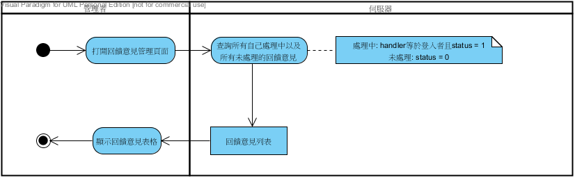
   
  圖5-3-14回饋意見管理之活動圖

  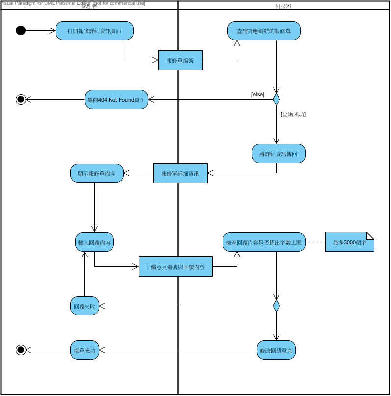
   
  圖5-3-15管理者處理回饋意見之活動圖

  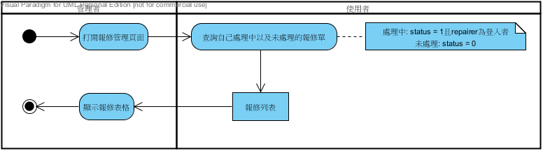
   
  圖5-3-16報修管理之活動圖

  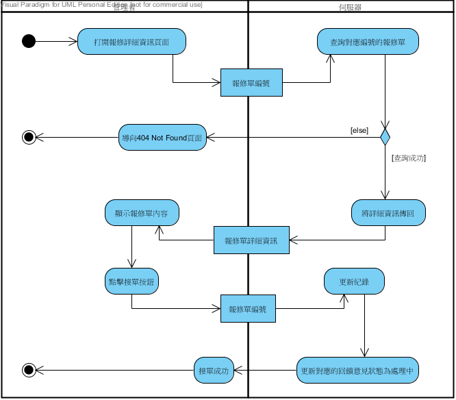
   
  圖5-3-17管理者報修接單之活動圖

  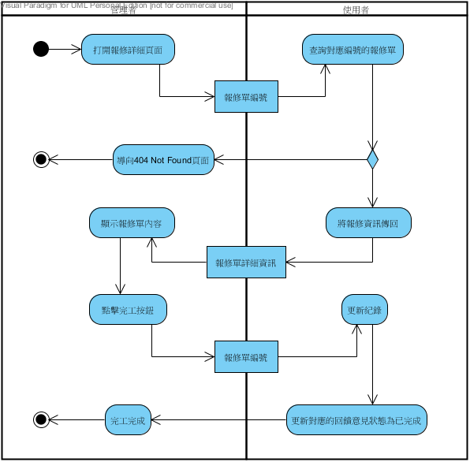
   
  圖5-3-18管理者報修完工之活動圖

## 5-4 分析類別圖

  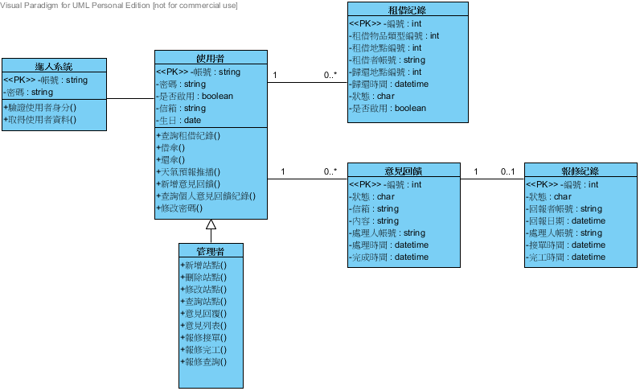
   
  圖5-4-1分析類別圖
