# 第6章 設計模型

## 6-1 循序圖

  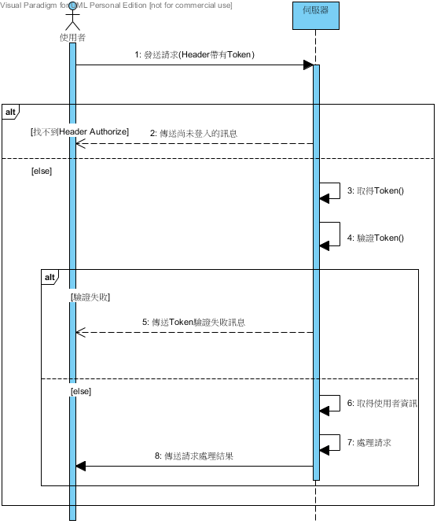
   
  圖6-1-1驗證之循序圖

  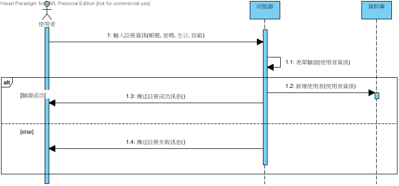
   
  圖6-1-2註冊之循序圖

  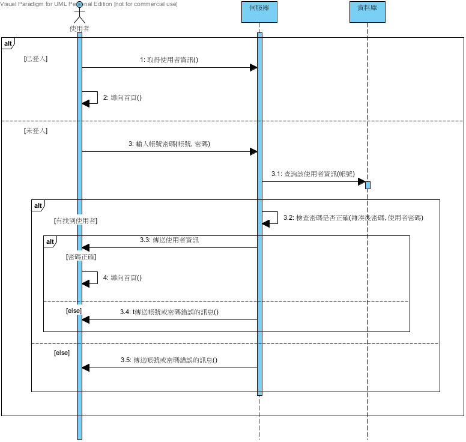
   
  圖6-1-3登入之循序圖

  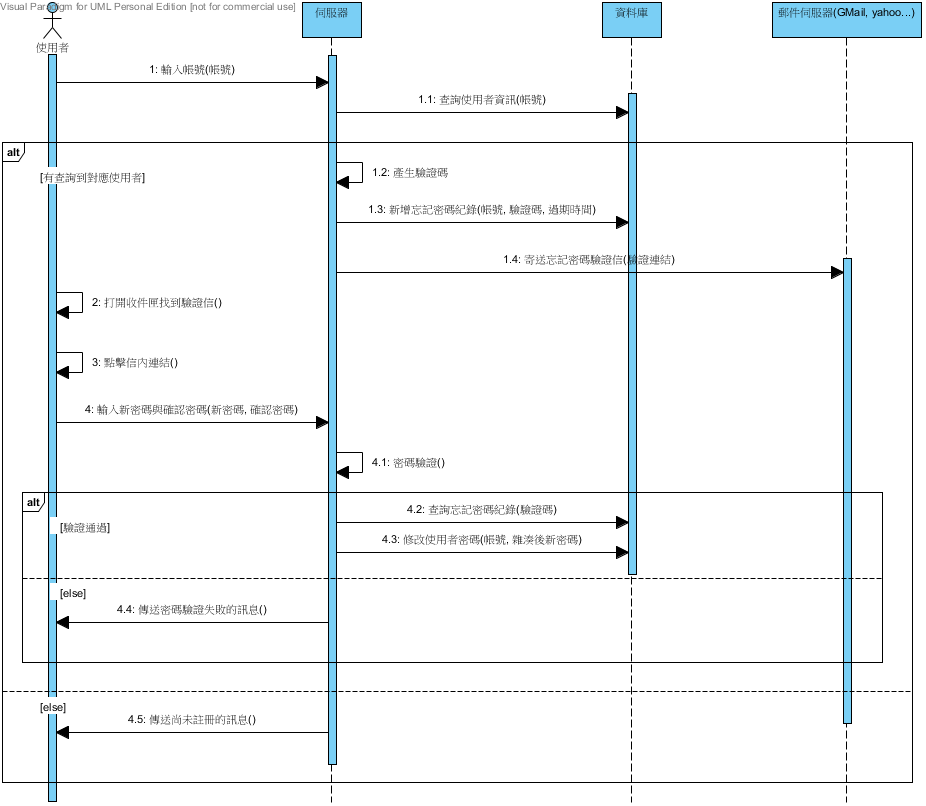
   
  圖6-1-4忘記密碼之循序圖

  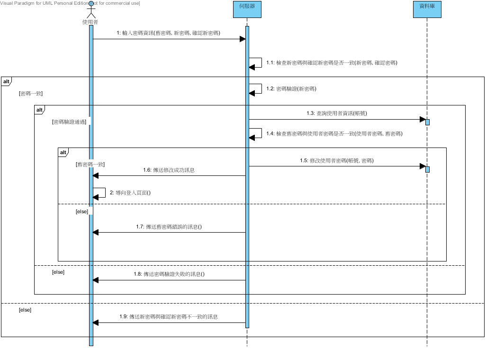
   
  圖6-1-5修改密碼之循序圖

  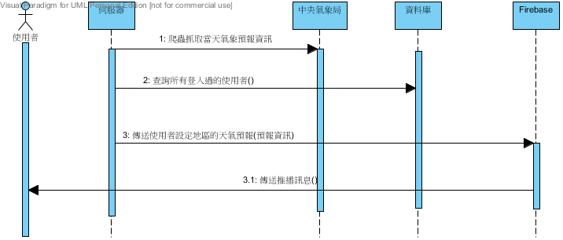
   
  圖6-1-6天氣預報推播之循序圖

  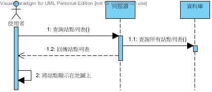
   
  圖6-1-7站點地圖之循序圖

  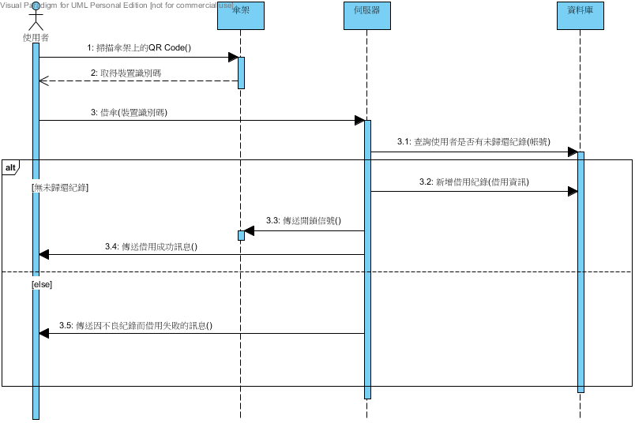
   
  圖6-1-8借傘之循序圖

  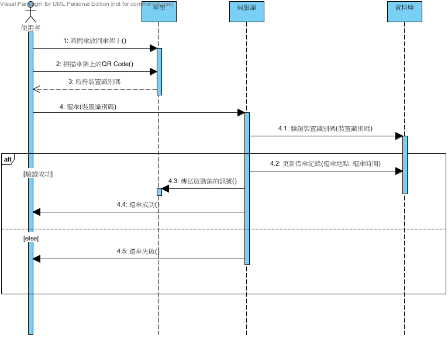
   
  圖6-1-9還傘之循序圖

  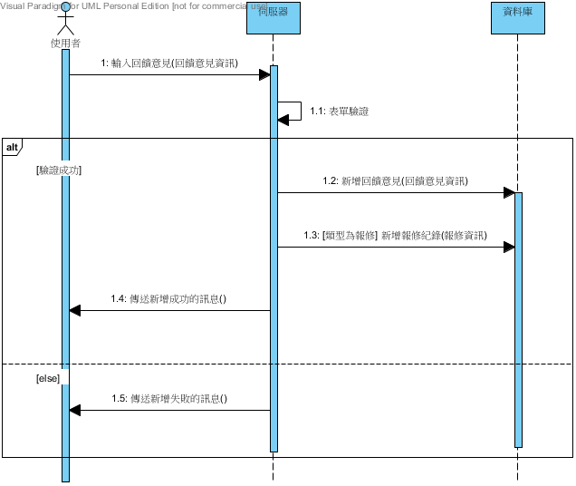
   
  圖6-1-10回饋意見之循序圖

  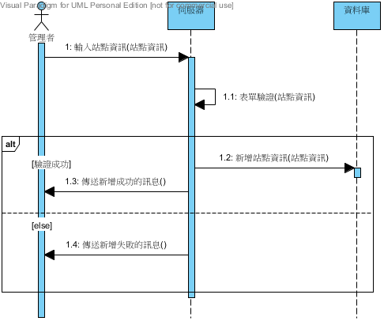
   
  圖6-1-11新增站點之循序圖

  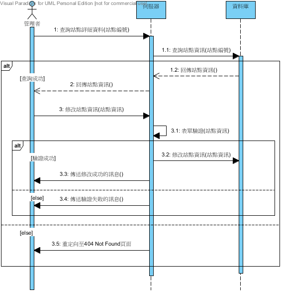
   
  圖6-1-12修改站點之循序圖

  
   
  圖6-1-13刪除站點之循序圖

  
   
  圖6-1-14回饋意見管理之循序圖

  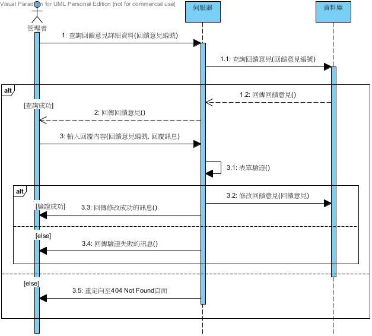
   
  圖6-1-15管理者處理回饋意見之循序圖

  
   
  圖6-1-16報修管理之循序圖

  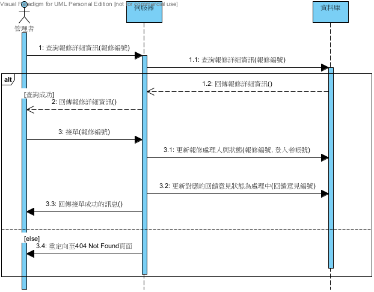
   
  圖6-1-17管理者報修接單之循序圖

  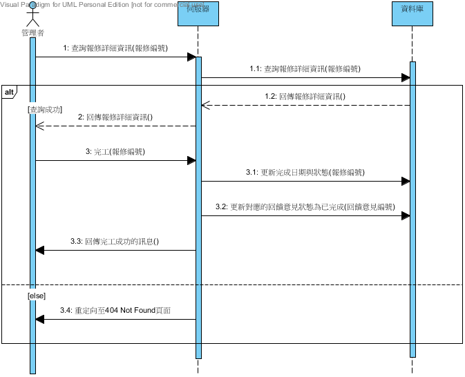
   
  圖6-1-18管理者報修完工之循序圖

## 6-2 設計類別圖

  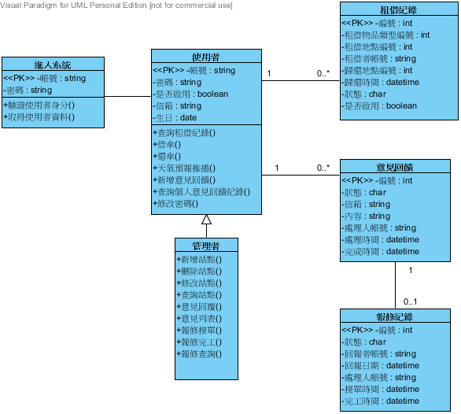
   
  圖6-2-1設計類別圖
