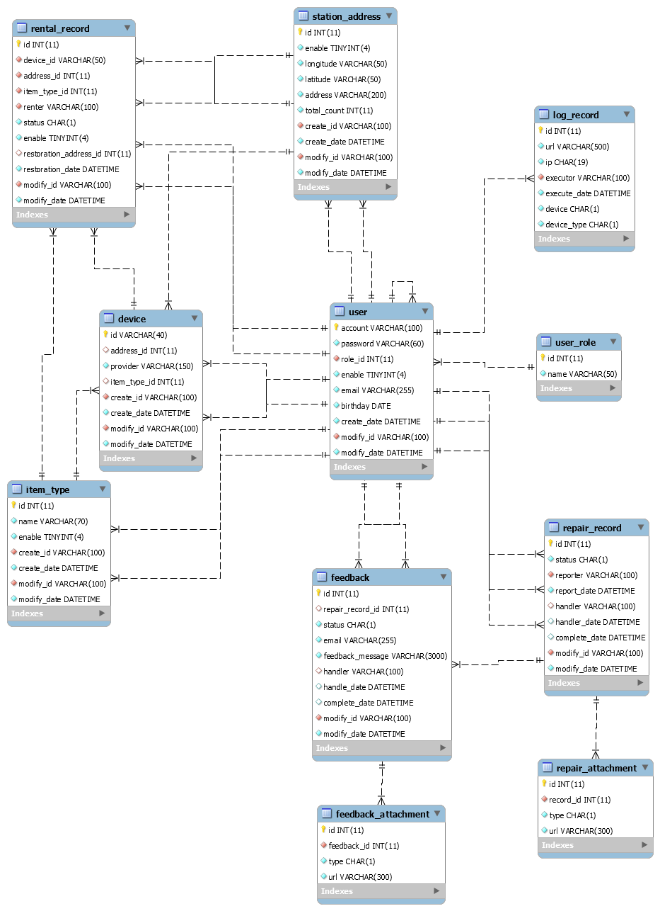

# 第8章 資料庫設計

## 8-1 資料庫關聯圖

  
   
  圖 8-1-1 資料庫關聯圖

## 8-2 表格及其Meta data

表 8-2-1 user_role - 使用者權限
| 欄位名稱 |   意義   |    型態     | 空值 | 主鍵 |      規則      |
|:--------:|:--------:|:-----------:|:----:|:----:|:--------------:|
|    id    |   編號   |   int(11)   |      |  V   | auto_increment |
|   name   | 權限名稱 | varchar(50) |      |      |                |

表 8-2-2 user - 使用者
|  欄位名稱   |            意義             |     型態     | 空值 | 主鍵 |      規則       |
|:-----------:|:---------------------------:|:------------:|:----:|:----:|:---------------:|
|   account   |            帳號             | varchar(40)  |      |  V   |                 |
|  password   |            密碼             |   int(11)    |      |      |                 |
|   role_id   |          權限編號           | varchar(150) |      |      | 參照：user_role |
|   enable    | 是否啟用(0: 不啟用/1: 啟用) |  tinyint(4)  |      |      |     預設：1     |
|    email    |            信箱             | varchar(255) |      |      |                 |
|  birthday   |            生日             |     date     |      |      |                 |
| create_date |          建立日期           |   datetime   |      |      | 預設：新增日期  |
|  modify_id  |       最後修改者帳號        | varchar(100) |      |      |   參照：user    |
| modify_date |        最後修改日期         |   datetime   |      |      | 預設：新增日期  |

表 8-2-3 log_record - 使用者日誌紀錄
|   欄位名稱   |                                     意義                                      |     型態     | 空值 | 主鍵 |      規則      |
|:------------:|:-----------------------------------------------------------------------------:|:------------:|:----:|:----:|:--------------:|
|      id      |                                     編號                                      |   int(11)    |      |  V   | auto_increment |
|     url      |                                     網址                                      | varchar(500) |      |      |                |
|      ip      |                                  操作者IPv4                                   |   char(19)   |      |      |                |
|   executor   |                   操作者帳號(若為訪客，則帳號為：anonymous)                   | varchar(100) |      |      |   參照：user   |
| execute_date |                                   操作日期                                    |   datetime   |      |      | 預設：新增日期 |
|    device    |                          使用設備(1: 瀏覽器/ 1:App)                           |   char(1)    |      |      |                |
| device_type  | 設備類型(0: IE/ 1: Edge/ 2: Chrome/ 3:FireFox/ 4: Safari/ 5: Android/ 6: iOS) |   char(1)    |      |      |                |

表 8-2-4 item_type - 物品類型
|  欄位名稱   |            意義             |     型態     | 空值 | 主鍵 |      規則      |
|:-----------:|:---------------------------:|:------------:|:----:|:----:|:--------------:|
|     id      |            編號             |   int(11)    |      |  V   | auto_increment |
|    name     |          物品名稱           | varchar(70)  |      |      |                |
|   enable    | 是否啟用(0: 不啟用/1: 啟用) |  tinyint(4)  |      |      |    預設：1     |
|  create_id  |         建立者帳號          | varchar(100) |      |      |   參照：user   |
| create_date |          建立日期           |   datetime   |      |      | 預設：新增日期 |
|  modify_id  |       最後修改者帳號        | varchar(100) |      |      |   參照：user   |
| modify_date |        最後修改日期         |   datetime   |      |      | 預設：新增日期 |

表 8-2-5 station_address - 站點地址
|   欄位名稱   |            意義             |     型態     | 空值 | 主鍵 |      規則       |
|:------------:|:---------------------------:|:------------:|:----:|:----:|:---------------:|
|      id      |            編號             |   int(11)    |      |  V   | auto_increment  |
|    enable    | 是否啟用(0: 不啟用/1: 啟用) |  tinyint(4)  |      |      |     預設：1     |
|  longitude   |            經度             | varchar(50)  |      |      |                 |
|   latitude   |            緯度             | varchar(50)  |      |      |                 |
|   address    |          詳細地址           | varchar(200) |      |      |                 |
| total_count  |         可租借總數          |   int(11)    |      |      |                 |
|  create_id   |         建立者帳號          | varchar(100) |      |      |   參照：user    |
| create_date  |          建立日期           |   datetime   |      |      | 預設：新增日期  |
|  modify_id   |       最後修改者帳號        | varchar(100) |      |      |   參照：user    |
| modify_date  |        最後修改日期         |   datetime   |      |      | 預設：新增日期  |

表 8-2-6 device - 裝置
|   欄位名稱   |      意義      |     型態     | 空值 | 主鍵 |         規則          |
|:------------:|:--------------:|:------------:|:----:|:----:|:---------------------:|
|      id      |    裝置編號    | varchar(40)  |      |  V   |    auto_increment     |
|  adress_id   |  裝置所在地點  |   int(11)    |  V   |      | 參照：station_address |
|   provider   |   提供者名稱   | varchar(150) |      |      |                       |
| item_type_id |  租借物品類型  |   int(11)    |  V   |      |    參照：item_type    |
|  create_id   |   建立者帳號   | varchar(100) |      |      |      參照：user       |
| create_date  |    建立日期    |   datetime   |      |      |    預設：新增日期     |
|  modify_id   | 最後修改者帳號 | varchar(100) |      |      |      參照：user       |
| modfiy_date  |  最後修改日期  |   datetime   |      |      |    預設：新增日期     |

表 8-2-7 rental_record - 租借紀錄
|        欄位名稱        |                       意義                        |     型態     | 空值 | 主鍵 |         規則          |
|:----------------------:|:-------------------------------------------------:|:------------:|:----:|:----:|:---------------------:|
|           id           |                       編號                        |   int(11)    |      |  V   |    auto_increment     |
|       device_id        |                     裝置編號                      | VARCHAR(50)  |      |      |     參照：device      |
|       address_id       |                   租借地點編號                    |   int(11)    |      |      | 參照：station_address |
|      item_type_id      |                   租借物品類型                    |   int(11)    |      |      |    參照：item_type    |
|         renter         |                    租借者帳號                     | varchar(100) |      |      |      參照：user       |
|         status         | 狀態(0: 出借中/1: 已歸還/2: 損壞/3: 遺失/4: 被搶) |   char(1)    |      |      |        預設：0        |
|         enable         |            是否啟用(0: 不啟用/1: 啟用)            |  tinyint(4)  |      |      |        預設：1        |
| restoration_address_id |                   歸還地點編號                    |   int(11)    |  V   |      | 參照：station_address |
|    restoration_date    |                     歸還日期                      |   datetime   |  V   |      |                       |
|       modify_id        |                  最後修改者帳號                   | varchar(100) |      |      |      參照：user       |
|      modify_date       |                   最後修改日期                    |   datetime   |      |      |    預設：新增日期     |

表 8-2-8 repair_record - 報修紀錄
|   欄位名稱    |                意義                 |     型態     | 空值 | 主鍵 |      規則      |
|:-------------:|:-----------------------------------:|:------------:|:----:|:----:|:--------------:|
|      id       |                編號                 |   int(11)    |      |  V   | auto_increment |
|    status     | 狀態(0: 待處理/1: 處理中/2: 已完成) |   char(1)    |      |      |                |
|   reporter    |             報修者帳號              | varchar(100) |      |      |   參照：user   |
|  report_date  |              報修日期               |   datetime   |      |      |                |
|    handler    |             處理人帳號              | varchar(100) |  V   |      |   參照：user   |
|  handle_date  |              處理日期               |   datetime   |  V   |      |                |
| complete_date |              完成日期               |   datetime   |  V   |      |                |
|   modify_id   |           最後修改者帳號            | varchar(100) |      |      |   參照：user   |
|  modify_date  |            最後修改日期             |   datetime   |      |      | 預設：新增日期 |

表 8-2-9 repair_record_attachment - 報修紀錄附件
| 欄位名稱  |           意義            |     型態     | 空值 | 主鍵 |          規則          |
|:---------:|:-------------------------:|:------------:|:----:|:----:|:----------------------:|
|    id     |           編號            |   int(11)    |      |  V   |     auto_increment     |
| record_id |       報修紀錄編號        |   int(11)    |      |      | 參照：repair_record_id |
|   type    | 附件類型(0: 照片/1: 影片) |   char(1)    |      |      |                        |
|    url    |         附件網址          | varchar(255) |      |      |                        |

表 8-2-10 feedback - 回饋意見
|     欄位名稱     |                意義                 |     型態      | 空值 | 主鍵 |        規則         |
|:----------------:|:-----------------------------------:|:-------------:|:----:|:----:|:-------------------:|
|        id        |                編號                 |    int(11)    |      |  V   |   auto_increment    |
| repair_record_id |            報修紀錄編號             |    int(11)    |  V   |      | 參照：repair_record |
|      status      | 狀態(0: 待處理/1: 處理中/2: 已完成) |    char(1)    |      |      |                     |
|      email       |             回饋者信箱              | varchar(255)  |      |      |                     |
| feedback_message |              回饋內容               | varchar(3000) |      |      |                     |
|     handler      |             處理人帳號              | varchar(100)  |  V   |      |     參照：user      |
|   handle_date    |              處理日期               |   datetime    |  V   |      |                     |
| content_message  |              回應內容               | varchar(3000) |  V   |      |                     |
|  complete_date   |              完成日期               |   datetime    |  V   |      |                     |
|    modify_id     |           最後修改者帳號            | varchar(100)  |      |      |     參照：user      |
|   modify_date    |            最後修改日期             |   datetime    |      |      |   預設：新增日期    |

表 8-2-11 feedback_attachment - 回饋意見附件
|  欄位名稱   |           意義            |     型態     | 空值 | 主鍵 |      規則      |
|:-----------:|:-------------------------:|:------------:|:----:|:----:|:--------------:|
|     id      |           編號            |   int(11)    |      |  V   | auto_increment |
| feedback_id |       回饋意見編號        |   int(11)    |      |      | 參照：feedback |
|    type     | 附件類型(0: 照片/1: 影片) |   char(1)    |      |      |                |
|     url     |         附件網址          | varchar(255) |      |      |                |
